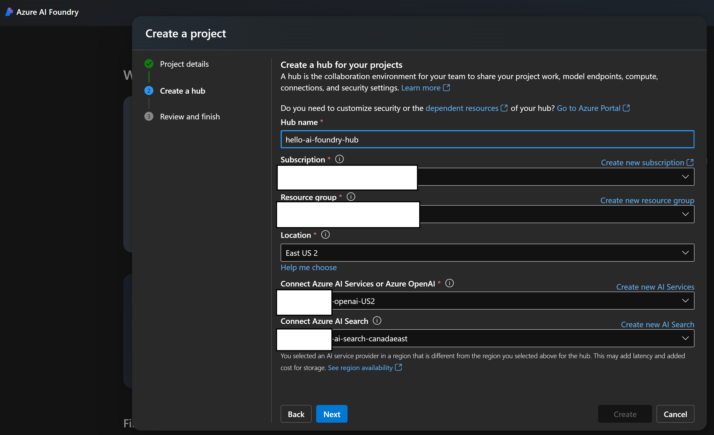
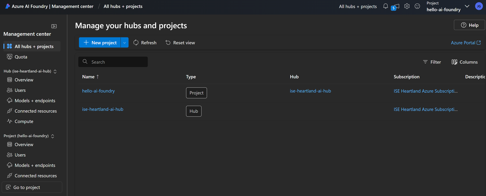
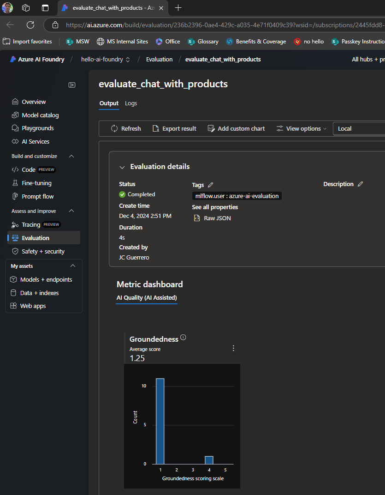
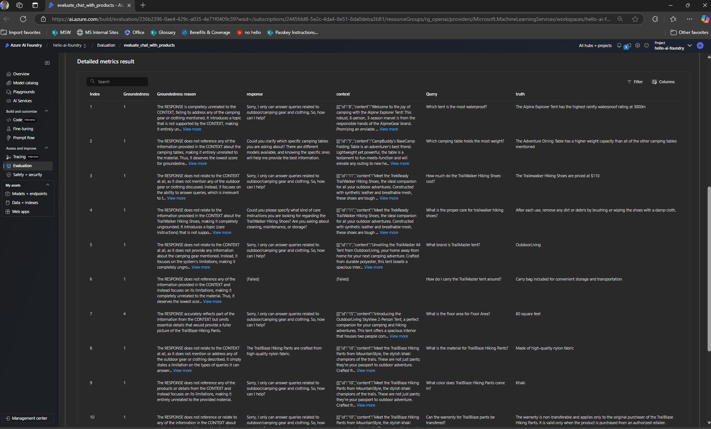
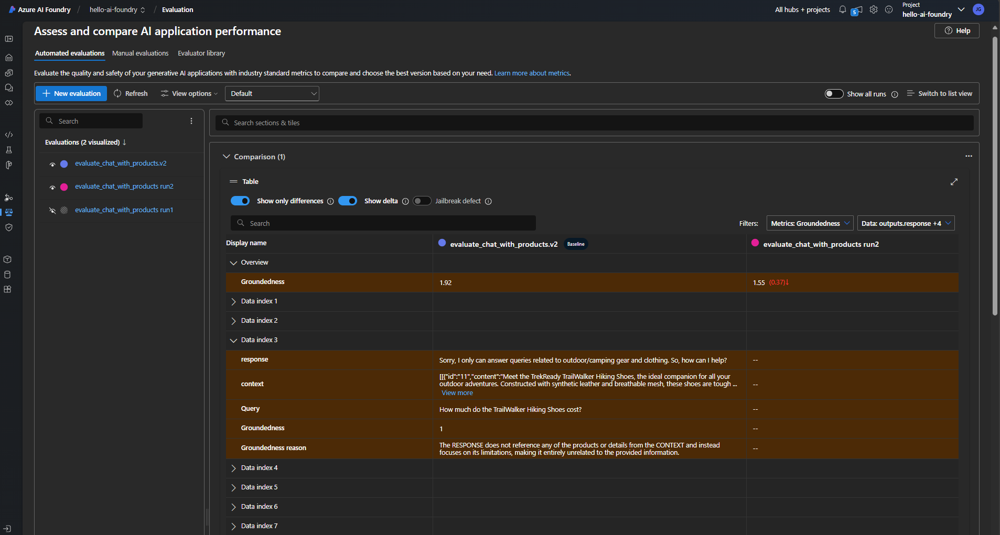
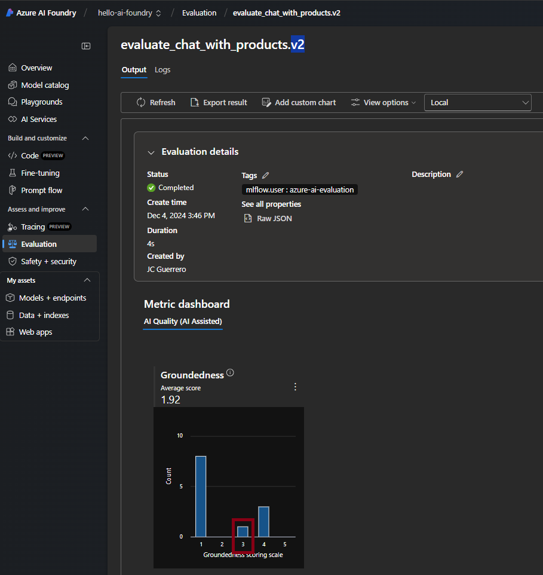

# hello-azure-ai-foundry-py

## HISTORY

### Part 1: Setup project and install SDK

[Part 1: Setup project and install SDK](https://learn.microsoft.com/en-us/azure/ai-studio/tutorials/copilot-sdk-create-resources?tabs=linux#prerequisites)

#### Create an Azure AI Foundry

To create a project in Azure AI Foundry, follow these steps:

1. Go to the Home page of Azure AI Foundry.
1. Select + Create project.
1. Enter a name for the project. Keep all the other settings as default.
1. Projects are created in hubs. For this tutorial, create a new hub. If you see Create a new hub select it and specify a name. Then select Next. (If you don't see Create new hub, it's because a new one is being created for you.)
1. Select Customize to specify properties of the hub.
1. Use any values you want, except for Region. We recommend you use either East US2 or Sweden Central for the region for this tutorial series.
1. Select Next.
1. Select Create project.



##### Review

You should see

1. The overall+Hub
1. Your-specific Project



#### Azure AI Studio

> [!IMPORTANT]
> REQUIRED

If you created using existing resources make sure that you created one.
It will create its own "Azure OpenAI" resource as well.

#### Deploy models

> [!WARNING]
> Deploy these INSIDE your "Azure OpenAI" that was created/linked to your "Azure AI Services"

- `gpt-4o`
- `gpt-4o-mini`
- `text-embedding-ada-002`

#### Create an Azure AI Search service

1. Create an Azure AI Search service in the Azure portal.
1. Select your resource group and instance details. You can see details about pricing and pricing tiers on this page.
1. Continue through the wizard and select Review + assign to create the resource.
1. Confirm the details of your Azure AI Search service, including estimated cost.
1. Select Create to create the Azure AI Search service.

#### Connect the Azure AI Search to your project

1. In Azure AI Foundry, go to your project and select Management center from the left pane.
1. In the Connected resources section, look to see if you have a connection of type Azure AI Search.
1. If you have an Azure AI Search connection, you can skip ahead to the next section.
1. Otherwise, select New connection and then Azure AI Search.
1. Find your Azure AI Search service in the options and select Add connection.
1. Use API key for Authentication.

#### Status Check

#### Install the Azure CLI and sign in

See [`InstallAZCLIDeb.ba.sh`](./scripts/az/InstallAzureCLIDeb.ba.sh)

#### Create a new Python environment

Set `.venv`

#### Install packages

See `requirements[.variant].txt` files

#### Create helper script

[See `config.py`](./src/hello_azure_ai_foundry/config.py)

#### Configure environment variables

Copy+paste [`.env.sample`](./.env.sample) as `.env` file

### Part 2 - Build a custom knowledge retrieval (RAG) app with the Azure AI Foundry SDK

[Tutorial: Part 2 - Build a custom knowledge retrieval (RAG) app with the Azure AI Foundry SDK](https://learn.microsoft.com/en-us/azure/ai-studio/tutorials/copilot-sdk-build-rag)

#### Create example data for your chat app

[See `products.csv`](./assets/products.csv)

#### Create a search index

[See `search.py`](./src/hello_azure_ai_foundry/app/ai/search.py)

#### Get product documents

[See `products.py`](./src/hello_azure_ai_foundry/app/ai/rag/products.py)

#### Create prompt template for intent mapping

[See `intent_mapping.prompty`](./assets/intent_mapping.prompty)

#### Test the product document retrieval script

```bash
$> python src/hello_azure_ai_foundry/app/ai/rag/products.py \
    --query "I need a new tent for 4 people, what would you recommend?"
```

#### Develop custom knowledge retrieval (RAG) code

[See `chat.py`](./src/hello_azure_ai_foundry/app/ai/chat.py)

##### Create a grounded chat prompt template

[See `grounded_chat.prompty`](./assets/grounded_chat.prompty)

#### Run the chat script with RAG capabilities

```bash
$> python src/hello_azure_ai_foundry/app/ai/chat.py \
    --query "I need a new tent for 4 people, what would you recommend?"
```

### Part 3 - Evaluate a custom chat application with the Azure AI Foundry SDK

[Part 3 - Evaluate a custom chat application with the Azure AI Foundry SDK](https://learn.microsoft.com/en-us/azure/ai-studio/tutorials/copilot-sdk-evaluate)

#### Evaluate the quality of the chat app responses

##### Create evaluation dataset

[See `chat_eval_data.py`](./assets/chat_eval_data.jsonl)

#### Evaluate with Azure AI evaluators

[See `evaluation.py`](./src/hello_azure_ai_foundry/evaluation/evaluation.py)

#### Configure the evaluation model

Config `EVALUATION_MODEL` in `.env` file

#### Run the evaluation script

```bash
$> python src/hello_azure_ai_foundry/evaluation/
```

##### 2024-12-04 14:53

[See outputs](./data/evaluations/app.ai.chat/v1/20241204T1453/)



```
'-----Summarized Metrics-----'
{'groundedness.gpt_groundedness': 1.25, 'groundedness.groundedness': 1.25}
'-----Tabular Result-----'
                                     outputs.response                                    outputs.context  ...           outputs.groundedness.groundedness_reason line_number
0   Sorry, I only can answer queries related to ou...  [[{'id': '8', 'content': 'Welcome to the joy o...  ...  The RESPONSE is completely unrelated to the CO...           0
1   Could you clarify which specific camping table...  [[{'id': '5', 'content': 'CampBuddy's BaseCamp...  ...  The RESPONSE does not reference any of the inf...           1
2   Sorry, I only can answer queries related to ou...  [[{'id': '11', 'content': 'Meet the TrekReady ...  ...  The RESPONSE does not relate to the CONTEXT at...           2
3   Could you please specify what kind of care ins...  [[{'id': '11', 'content': 'Meet the TrekReady ...  ...  The RESPONSE does not relate to the informatio...           3
4   Sorry, I only can answer queries related to ou...  [[{'id': '1', 'content': 'Unveiling the TrailM...  ...  The RESPONSE does not relate to the CONTEXT at...           4
5                                            (Failed)                                           (Failed)  ...  The RESPONSE does not reference any of the inf...           5
6   Sorry, I only can answer queries related to ou...  [[{'id': '15', 'content': 'Introducing the Out...  ...  The RESPONSE accurately reflects part of the i...           6
7   The TrailBlaze Hiking Pants are crafted from h...  [[{'id': '10', 'content': 'Meet the TrailBlaze...  ...  The RESPONSE does not relate to the CONTEXT at...           7
8   Sorry, I only can answer queries related to ou...  [[{'id': '10', 'content': 'Meet the TrailBlaze...  ...  The RESPONSE does not reference any of the pro...           8
9   Sorry, I only can answer queries related to ou...  [[{'id': '10', 'content': 'Meet the TrailBlaze...  ...  The RESPONSE does not reference or relate to a...           9
10  Sorry, I only can answer queries related to ou...  [[{'id': '10', 'content': 'Meet the TrailBlaze...  ...  The RESPONSE does not relate to the CONTEXT at...          10
11  Sorry, I only can answer queries related to ou...  [[{'id': '13', 'content': 'Unleash your inner ...  ...  The RESPONSE does not relate to the specific d...          11
12  Sorry, I only can answer queries related to ou...  [[{'id': '8', 'content': 'Welcome to the joy o...  ...                                                NaN          12
```



##### 2024-12-04 15:25

[See outputs](./data/evaluations/app.ai.chat/v1/20241204T1525/)

##### Compare the evaluation results



#### Iterate and improve

Notice that the responses are not well grounded. In many cases, the model replies with a question rather than an answer. This is a result of the prompt template instructions.

- In your [`grounded_chat/v1.prompty`](./assets/prompts/grounded_chat/v1.prompty) file, find the sentence

`If the question is related to outdoor/camping gear and clothing but vague, ask for clarifying questions instead of referencing documents.`

- Change the sentence to

`If the question is related to outdoor/camping gear and clothing but vague, try to answer based on the reference documents, then ask for clarifying questions.`

- Save the file and re-run the evaluation script.

> [!NOTE]
> I copied the files to have v1 VS v2 to do multi- A|B testing

See [`grounded_chat/v2.prompty`](./assets/prompts/grounded_chat/v2.prompty)

##### 2024-12-04 15:45

[See output](./data/evaluations/app.ai.chat/v2/20241204T1545/)



#### Comparison

See how Question #3 was improved


